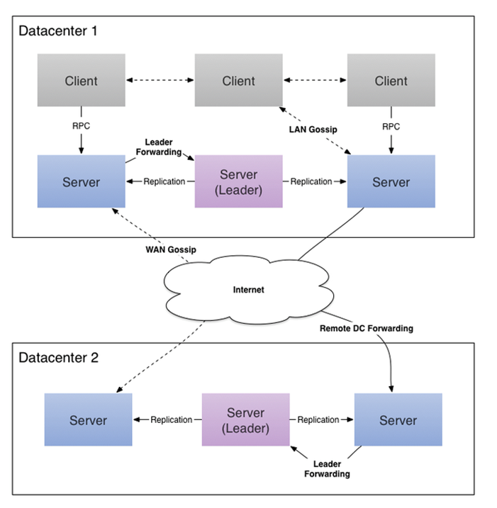

# Consul 详解
## 一、为什么要用consul
 在选型微服务注册中心时，一定要长远考虑，SpringCloud提供了Eureka作为服务注册中心，我们可以开箱即用，但是，对于服务注册中心随着业务需求的不断变化，对服务注册中心提出了更高要求，Eureka就不太适合了，看到“Eureka 2.0 开源工作宣告停止，继续使用风险自负”。
 
 这意味着如果开发者继续使用作为 2.x 分支上现有工作 repo 一部分发布的代码库和工件，则将自负风险，对此，专家建议开发者尽快将相关业务迁移到 Consul/ZooKeeper/Etcd 等工具上。

## 二、 Consul与Zookeeper的区别
  ZooKeeper、Doozerd、Etcd在架构上都非常相似，它们都有服务节点（server node），而这些服务节点的操作都要求达到节点的仲裁数（通常，节点的仲裁数遵循的是简单多数原则）。此外，它们都是强一致性的，并且提供各种原语。通过应用程序内部的客户端lib库，这些原语可以用来构建复杂的分布式系统。
  
  Consul在一个单一的数据中心内部使用服务节点。在每个数据中心中，为了Consule能够运行，并且保持强一致性，Consul服务端需要仲裁。然而，Consul原生支持多数据中心，就像一个丰富gossip系统连接服务器节点和客户端一样。
  
  当提供K/V存储的时候，这些系统具有大致相同的语义，读取是强一致性的，并且在面对网络分区的时候，为了保持一致性，读取的可用性是可以牺牲的。然而，当系统应用于复杂情况时，这种差异会变得更加明显。
  
  这些系统提供的语义对开发人员构建服务发现系统很有吸引力，但更重要的是，强调开发人员要构建这些特性。ZooKeeper只提供一个原始的K/V值存储，并要求开发人员构建他们自己的系统来提供服务发现功能。相反的是，Consul提供了一个坚固的框架，这不仅仅是为了提供服务发现功能，也是为了减少推测工作和开发工作量。客户端只需简单地完成服务注册工作，然后使用一个DNS接口或者HTTP接口就可以执行工作了，而其他系统则需要你定制自己的解决方案。
  
  一个令人信服的服务发现框架必须包含健康检测功能，并且考虑失败的可能性。要是节点失败或者服务故障了，即使开发人员知道节点A提供Foo服务也是没用的。Navie系统利用的是心跳、周期性更新和TTLs，这些系统不仅需要工作量与节点数量成线性关系，并且对服务器的固定数量提出了要求。此外，故障检测窗口的存活时间至少要和TTL一样长。
  
  ZooKeeper提供了临时节点，这些临时节点就是K/V条目，当客户端断开连接时，这些条目会被删除。虽然这些临时节点比一个心跳系统更高级，但仍存在固有的扩展性问题，并且会增加客户端的复杂性。与ZooKeeper服务器端连接时，客户端必须保持活跃，并且去做持续性连接。此外，ZooKeeper还需要胖客户端，而胖客户端是很难编写，并且胖客户端会经常导致调试质询。
  
  Consul使用一个完全不同的架构进行健康检测。Consul客户端可以运行在集群中的每一个节点上，而不是拥有服务器节点，这些Consul客户端属于一个gossip pool，gossip pool提供了一些功能，包括分布式健康检测。gossip协议提供了一个高效的故障检测工具，这个故障检测工具可以应用到任意规模的集群，而不仅仅是作用于特定的服务器组。同时，这个故障检测工具也支持在本地进行多种健康检测。与此相反，ZooKeeper的临时节点只是一个非常原始的活跃度检测。因为有了Consul，客户端可以检测web服务器是否正在返回200状态码，内存利用率是否达到临界点，是否有足够的数据存储盘等。此外，ZooKeeper会暴露系统的复杂性给客户端，为了避免ZooKeeper出现的这种情况，Consul只提供一个简单HTTP接口。
  
  Consul为服务发现、健康检测、K/V存储和多数据中心提供了一流的支持。为了支持任意存储，而不仅仅是简单的K/V存储，其他系统都要求工具和lib库要率先建立。然而，通过使用客户端节点，Consul提供了一个简单的API，这个API的开发只需要瘦客户端就可以了， 而且，通过使用配置文件和DNS接口，开发人员可以建立完整的服务发现解决方案，最终，达到避免开发API的目的。
  
  | Feature              | Consul                 |  zookeeper            | etcd              | euerka                       |
  | -------------------- | -----------------------| --------------------- | ----------------- | ---------------------------- |
  | 服务健康检查         | 服务状态，内存，硬盘等 | (弱)长连接，keepalive | 连接心跳          | 可配支持                     |
  | 多数据中心           | 支持                   | —                    | —                | —                           |
  | kv存储服务           | 支持                   | 支持                  | 支持              | —                           |
  | 一致性               | raft                   | paxos                 | raft              | —                           |
  | cap                  | ca                     | cp                    | cp                | ap                           |
  | 使用接口(多语言能力) | 支持http和dns          | 客户端                | http/grpc         | http（sidecar）              |
  | watch支持            | 全量/支持long polling  | 支持                  | 支持 long polling | 支持 long polling/大部分增量 |
  | 自身监控             | metrics                | —                    | metrics           | metrics                      |
  | 安全                 | acl/https              | acl                   | https支持（弱）   | —                           |
  | spring cloud集成     | 已支持                 | 已支持                | 已支持            | 已支持                       |

## 三、 Consul 服务发现框架介绍
  Consul是强一致性的数据存储，使用gossip形成动态集群。它提供分级键/值存储方式，不仅可以存储数据，而且可以用于注册器件事各种任务，从发送数据改变通知到运行健康检查和自定义命令，具体如何取决于它们的输出。下面两张图是Consul的原理图
  
  
  - Consul 的使用场景
    -  docker 实例的注册与配置共享
    -  coreos 实例的注册与配置
    -  vitess 集群
    -  SaaS 应用的配置共享
    -  与 confd 服务集成，动态生成 nginx 和 haproxy 配置文件
  - Consul 的优势
    -   使用 Raft 算法来保证一致性, 比复杂的 Paxos 算法更直接. 相比较而言, zookeeper 采用的是 Paxos, 而 etcd 使用的则是 Raft.
    -   支持多数据中心，内外网的服务采用不同的端口进行监听。 多数据中心集群可以避免单数据中心的单点故障,而其部署则需要考虑网络延迟, 分片等情况等. zookeeper 和 etcd 均不提供多数据中心功能的支持.
    -   支持健康检查. etcd 不提供此功能.
    -   支持 http 和 dns 协议接口. zookeeper 的集成较为复杂, etcd 只支持 http 协议.
    -   官方提供web管理界面, etcd 无此功能.
  - Consul 的角色
    -   client: 客户端, 无状态, 将 HTTP 和 DNS 接口请求转发给局域网内的服务端集群. 
    -   server: 服务端, 保存配置信息, 高可用集群, 在局域网内与本地客户端通讯, 通过广域网与其他数据中心通讯. 每个数据中心的 server 数量推荐为 3 个或是 5 个.
  - 3.1 Consul 集群配置
  - 3.2 Consul 服务注册及健康检查
  - 3.3 Consul 
  Consul是用Go开发的分布式服务协调管理的工具，它提供了服务发现，健康检查，Key／Value存储等功能，并且支持跨数据中心的功能。consul提供的一些关键特性：
- service discovery：consul通过DNS或者HTTP接口使服务注册和服务发现变的很容易，一些外部服务，例如saas提供的也可以一样注册。
- health checking：健康检测使consul可以快速的告警在集群中的操作。和服务发现的集成，可以防止服务转发到故障的服务上面。
- key/value storage：一个用来存储动态配置的系统。提供简单的HTTP接口，可以在任何地方操作
- multi-datacenter：无需复杂的配置，即可支持任意数量的区域。

